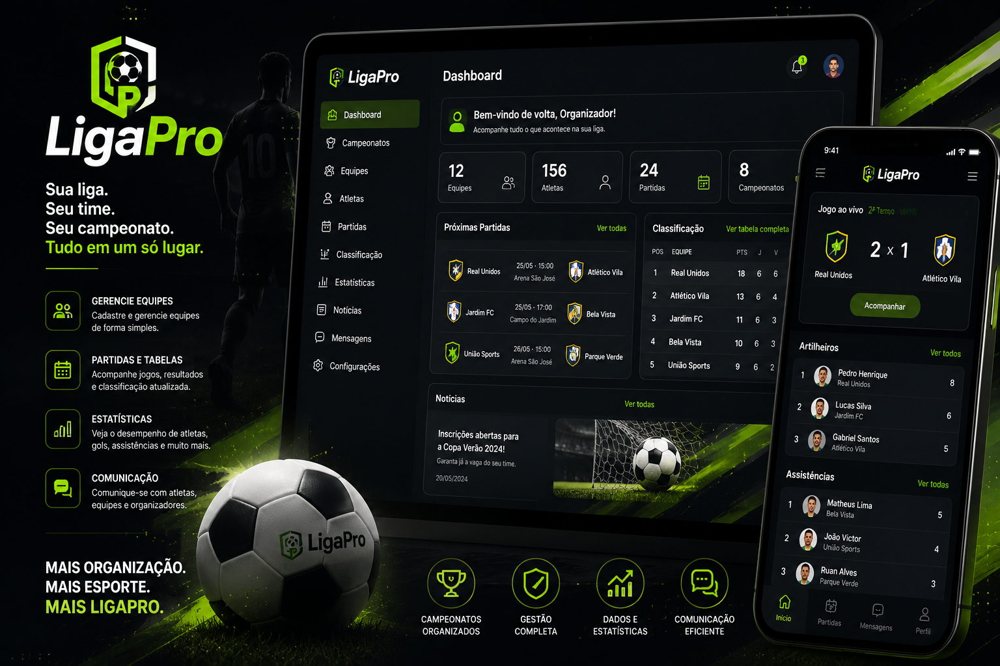

# 🚀 Jotta Portfolio

Meu portfólio pessoal desenvolvido para apresentar minha trajetória, habilidades, projetos e experiências nas áreas de Desenvolvimento de Software e Design.



---

## 👨‍💻 Sobre Mim

Sou estudante de Tecnologia em Análise e Desenvolvimento de Sistemas (TADS), desenvolvedor Full Stack e designer criativo.

Tenho experiência no desenvolvimento de aplicações Web e Mobile utilizando tecnologias modernas, além de atuar com criação de artes digitais, interfaces e projetos visuais.

---

## 🛠️ Tecnologias Utilizadas

### Frontend

- React
- Vite
- Tailwind CSS
- Framer Motion

### Backend (Projetos)

- Java
- Spring Boot
- MongoDB
- MySQL

### Ferramentas

- Git
- GitHub
- Figma
- VS Code

---

## 📂 Projetos em Destaque

### ⚽ LigaPro

Sistema completo para gerenciamento de campeonatos esportivos amadores.

#### Funcionalidades

- Cadastro de campeonatos
- Gestão de equipes
- Cadastro de atletas
- Controle de partidas
- Tabelas de classificação
- Estatísticas
- Comunicação entre participantes

#### Tecnologias

- React
- Spring Boot
- MongoDB
- TypeScript

---

### 📋 Sistema de Formalização de ETP e DFD

Plataforma voltada para auxiliar a criação e gerenciamento de:

- ETP (Estudo Técnico Preliminar)
- DFD (Documento de Formalização da Demanda)

---

### 📱 DietaAPP

Aplicativo para acompanhamento alimentar e organização nutricional.

---

### 🎮 Games360

Projeto para consulta e gerenciamento de informações relacionadas ao universo gamer.

---

### 📅 AgendaMidia

Sistema para gerenciamento e organização de conteúdos digitais.

---

## 🎨 Design

Além do desenvolvimento de software, também realizo:

- Artes para redes sociais
- Wallpapers personalizados
- Topos de bolo
- Materiais gráficos
- Design de interfaces (UI/UX)

---

## 🚀 Executando o Projeto

### Instalar dependências

```bash
npm install
```

### Executar ambiente de desenvolvimento

```bash
npm run dev
```

### Gerar build de produção

```bash
npm run build
```

### Visualizar build localmente

```bash
npm run preview
```

---

## 🌐 Deploy

O projeto está preparado para deploy em:

- Vercel
- Netlify
- GitHub Pages

---

## 📞 Contato

📧 E-mail: seuemail@email.com

💼 LinkedIn:
https://linkedin.com/in/seuusuario

🐙 GitHub:
https://github.com/seuusuario

---

## 📄 Licença

Este projeto é de uso pessoal e foi desenvolvido para apresentação profissional e acadêmica.

---

### Desenvolvido por Jotta ❤️